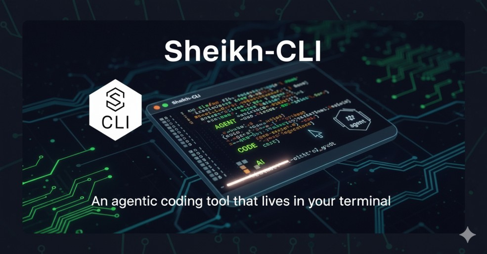

<div align="center">
  
  
  # Sheikh-CLI: AI Agents Your Unfair Advantage
  
  > **Powerful AI capabilities in your terminal. Build agents and workflows with our API. Turn hours-long workflows into a single command.**
</div>

[](https://badge.fury.io/js/@codienters/sheikh-cli)
[](https://opensource.org/licenses/MIT)
[](https://nodejs.org/)
[](https://github.com/codienters/sheikh-cli/actions/workflows/ci.yml)
[](https://github.com/codienters/sheikh-cli/actions/workflows/release.yml)
[](https://github.com/codienters/sheikh-cli/actions/workflows/agentic-ci.yml)
[](https://github.com/codienters/sheikh-cli/actions/workflows/dependency-updates.yml)

## 🚀 What is Sheikh-CLI?

Sheikh-CLI is an **agentic coding tool** that lives in your terminal and helps you turn ideas into code faster than ever before. It's your unfair advantage in AI-powered development.

### ✨ Key Features

- **🤖 Agentic Search**: Understand your entire codebase without manual context selection
- **🔄 Multi-File Coordination**: Make coordinated changes across multiple files
- **👁️ Visual Diffs**: See visual diffs and approve changes before they're applied
- **⚙️ Workflow Generation**: Turn natural language descriptions into executable workflows
- **🛡️ Production-Grade**: Never modifies files without explicit approval
- **🔧 IDE Integration**: Works with VS Code, JetBrains, and any terminal
- **🌐 Multi-Provider**: Supports Anthropic, OpenAI, AWS Bedrock, Google Vertex AI, and more

<div align="center">
  
</div>

## 🎯 Why Sheikh-CLI?

### Your Codebase, Evolving at Thought Speed

- **Search million-line codebases instantly** with agentic search
- **Turn hours-long workflows into a single command**
- **Your tools. Your workflow. Your codebase.**
- **Researchers and engineers use—right to your terminal**

### Powerful Intelligence

- Uses **agentic search** to understand your entire codebase
- Makes **coordinated changes** across multiple files
- **Optimized specifically** for code understanding
- Lives right inside your terminal—**no context switching**

### Integration Excellence

- Integrates with **VS Code / JetBrains IDEs**
- Uses your **test suites and build systems**
- **Never modifies your files** without explicit approval
- **Adapts to your coding standards** and patterns
- **Configurable**: Build on the SDK or run on GitHub Actions

## 📦 Installation

### Quick Install

```bash
npm install -g @codienters/sheikh-cli
```

### From Source

```bash
git clone https://github.com/codienters/sheikh-cli.git
cd sheikh-cli
npm install
npm link
```

## ⚡ Quick Start

### 1. Set Up Your API Key

```bash
# Anthropic (Recommended)
export API_KEY="your-anthropic-api-key"

# Or OpenAI
export OPENAI_API_KEY="your-openai-api-key"

# Or AWS Bedrock
export AWS_ACCESS_KEY_ID="your-aws-access-key"
export AWS_SECRET_ACCESS_KEY="your-aws-secret-key"
```

### 2. Initialize Configuration

```bash
sheikh config --init
```

### 3. Start Agentic Chat

```bash
sheikh chat --agentic
```

## 🎮 Usage Examples

### Agentic Search

```bash
# Search your entire codebase
sheikh search "authentication middleware"

# Search with filters
sheikh search "API endpoints" --type js --limit 5
```

### Codebase Analysis

```bash
# Analyze your entire codebase
sheikh analyze

# Generate detailed report
sheikh analyze --output report.md --format markdown
```

### Workflow Generation

```bash
# Generate workflow from natural language
sheikh workflow "deploy to production with tests"

# Execute workflow immediately
sheikh workflow "create new feature branch" --execute

# Preview workflow without executing
sheikh workflow "refactor authentication" --dry-run
```

### Interactive Chat

```bash
# Start agentic chat session
sheikh chat --agentic --visual-diff --coordinate

# Use slash commands in chat
/agents          # List available agents
/search <query>  # Search codebase
/analyze         # Analyze codebase
/workflow <desc> # Generate workflow
```

## 🤖 Available Agents

### Core Agents

| Agent | Purpose | Capabilities |
|-------|---------|-------------|
| **Codebase Analyzer** | Understand and index your codebase | Search, analyze, index, understand |
| **Multi-File Editor** | Coordinate changes across files | Edit, create, modify, coordinate |
| **Test Coordinator** | Manage testing workflows | Test, validate, coordinate, report |
| **Git Workflow** | Handle Git operations | Commit, push, branch, merge, PR |
| **Dependency Manager** | Manage project dependencies | Install, update, audit, resolve |
| **Security Auditor** | Audit code for security issues | Audit, scan, vulnerability, security |
| **Performance Optimizer** | Optimize code performance | Optimize, profile, benchmark, improve |
| **Documentation Generator** | Generate documentation | Generate, document, API, README |

### Custom Agents

Create your own agents for specific tasks:

```bash
# Create a custom agent
sheikh agents --create my-agent

# List all agents
sheikh agents --list

# Show agent status
sheikh agents --status
```

## 🔧 Configuration

### Environment Variables

```bash
# Anthropic
API_KEY="your-anthropic-api-key"
ANTHROPIC_API_KEY="your-anthropic-api-key"

# OpenAI
OPENAI_API_KEY="your-openai-api-key"
OPENAI_NATIVE_API_KEY="your-openai-native-api-key"

# AWS Bedrock
AWS_ACCESS_KEY_ID="your-aws-access-key"
AWS_SECRET_ACCESS_KEY="your-aws-secret-key"
AWS_SESSION_TOKEN="your-aws-session-token"
AWS_DEFAULT_REGION="us-east-1"

# Google Vertex AI
GOOGLE_APPLICATION_CREDENTIALS="path/to/credentials.json"
GEMINI_API_KEY="your-gemini-api-key"

# Other Providers
OPEN_ROUTER_API_KEY="your-openrouter-api-key"
CLINE_API_KEY="your-cline-api-key"
DEEP_SEEK_API_KEY="your-deepseek-api-key"
# ... and many more
```

### Configuration File

```json
{
  "globalState": {
    "apiProvider": "anthropic",
    "apiModelId": "claude-3-5-sonnet-20241022",
    "agenticEnabled": true,
    "autoApprovalSettings": {
      "enabled": true,
      "actions": {
        "readFiles": true,
        "editFiles": false,
        "executeSafeCommands": true,
        "useMcp": false
      },
      "maxRequests": 20
    }
  },
  "settings": {
    "cline.enableCheckpoints": false,
    "agentic.visualDiff": true,
    "agentic.coordinateChanges": true,
    "agentic.autoApprove": false
  }
}
```

## 🛠️ Advanced Features

### Agentic Search

Sheikh-CLI uses advanced semantic search to understand your entire codebase:

```bash
# Search by functionality
sheikh search "user authentication"

# Search by file type
sheikh search "database models" --type py

# Search with context
sheikh search "error handling middleware"
```

### Multi-File Coordination

Make coordinated changes across multiple files:

```bash
# Refactor across multiple files
sheikh chat "Refactor the authentication system to use JWT tokens"

# The system will:
# 1. Analyze all related files
# 2. Plan coordinated changes
# 3. Show visual diffs
# 4. Apply changes only after approval
```

### Workflow Generation

Generate complex workflows from natural language:

```bash
# Generate deployment workflow
sheikh workflow "Deploy to staging, run tests, and create PR"

# Generate development workflow
sheikh workflow "Create feature branch, implement feature, write tests, create PR"
```

### Visual Diff System

See exactly what changes will be made before they're applied:

```
📊 Visual Diff Preview:
─────────────────────────────────────────────────
📁 src/auth/middleware.js
   Type: modify
   Lines: 10-15
   + Added JWT verification
   - Removed session-based auth
   ─
📁 src/auth/routes.js
   Type: create
   Lines: 1-20
   + Added JWT routes
   ─
─────────────────────────────────────────────────

❓ Do you approve these changes? (y/n)
```

## 🔌 IDE Integration

### VS Code

Install the Sheikh-CLI extension for enhanced VS Code integration:

```bash
# Install VS Code extension
code --install-extension sheikh-cli.vscode-extension
```

### JetBrains

Enhanced capabilities in JetBrains IDEs:

```bash
# Install JetBrains plugin
sheikh install --ide jetbrains
```

### Terminal Integration

Works in any terminal with enhanced capabilities:

```bash
# Enable terminal integration
sheikh config --enable-terminal-integration
```

## 📚 Documentation

- **[CLAUDE.md](CLAUDE.md)** - Comprehensive development guide
- **[AGENTS.md](AGENTS.md)** - Agent system documentation
- **[GitHub Actions Setup](docs/github-actions-setup.md)** - Complete CI/CD setup guide
- **[API Reference](docs/api.md)** - Complete API documentation
- **[Examples](examples/)** - Usage examples and tutorials
- **[Contributing](CONTRIBUTING.md)** - How to contribute

## 🧪 Testing

```bash
# Run all tests
npm test

# Run tests in watch mode
npm run test:watch

# Run tests with coverage
npm run test:coverage

# Run specific test suite
npm run test:unit
npm run test:integration
npm run test:e2e
```

## 🔄 GitHub Actions & CI/CD

Sheikh-CLI uses comprehensive GitHub Actions workflows for automated testing, building, and deployment.

### 🚀 Available Workflows

| Workflow | Trigger | Purpose |
|----------|---------|---------|
| **CI Pipeline** | Push/PR to main/develop | Lint, test, build, security audit |
| **Release Pipeline** | Git tags, manual dispatch | Build, test, publish to NPM, create releases |
| **Agentic CI/CD** | Push/PR to main/develop | Advanced agentic analysis and testing |
| **Dependency Updates** | Weekly schedule, manual | Automated dependency updates and security patches |

### 📋 Repository Secrets

Configure these secrets in your GitHub repository settings:

#### Required Secrets

| Secret Name | Description | Required For |
|-------------|-------------|--------------|
| `NPM_TOKEN` | NPM authentication token | Publishing packages to NPM |
| `GITHUB_TOKEN` | GitHub API token | Creating releases and PRs |

#### Optional Secrets (for enhanced features)

| Secret Name | Description | Required For |
|-------------|-------------|--------------|
| `CODECOV_TOKEN` | Codecov upload token | Coverage reporting |
| `SLACK_WEBHOOK` | Slack webhook URL | Deployment notifications |
| `DISCORD_WEBHOOK` | Discord webhook URL | Release notifications |

### 🔧 Setting Up Repository Secrets

1. **Go to Repository Settings**
   ```
   GitHub Repository → Settings → Secrets and variables → Actions
   ```

2. **Add NPM_TOKEN**
   ```bash
   # Generate NPM token
   npm login
   npm token create --read-only=false
   
   # Add to GitHub secrets
   Name: NPM_TOKEN
   Value: npm_xxxxxxxxxxxxxxxxxxxxxxxxxxxxxxxx
   ```

3. **Verify Setup**
   ```bash
   # Check workflow status
   GitHub Repository → Actions tab
   
   # Verify CI pipeline runs on push/PR
   # Verify release pipeline runs on tag creation
   ```

### 🏗️ Workflow Details

#### CI Pipeline (`.github/workflows/ci.yml`)
- **Lint & Format Check**: ESLint and Prettier validation
- **Test Suite**: Runs tests on Node.js 18.x and 20.x
- **Build Check**: Validates build process
- **Security Audit**: Checks for vulnerabilities
- **Coverage Reporting**: Uploads coverage to Codecov

#### Release Pipeline (`.github/workflows/release.yml`)
- **Version Management**: Handles semantic versioning
- **Build & Test**: Comprehensive testing before release
- **NPM Publishing**: Publishes to `@codienters/sheikh-cli`
- **GitHub Releases**: Creates tagged releases with changelog
- **Artifact Management**: Uploads build artifacts

#### Agentic CI/CD (`.github/workflows/agentic-ci.yml`)
- **Agentic Analysis**: Advanced codebase analysis
- **Multi-Agent Testing**: Coordinated testing across agents
- **Security Audit**: Enhanced security scanning
- **Code Quality**: Advanced quality metrics
- **Deployment**: Automated deployment with monitoring

#### Dependency Updates (`.github/workflows/dependency-updates.yml`)
- **Weekly Schedule**: Runs every Monday at 9 AM UTC
- **Update Detection**: Identifies outdated packages
- **Security Patches**: Applies security fixes
- **Automated PRs**: Creates pull requests for updates
- **Testing**: Validates updates before merging

### 📊 Workflow Status Badges

Add these badges to your README:

```markdown
[](https://github.com/codienters/sheikh-cli/actions/workflows/ci.yml)
[](https://github.com/codienters/sheikh-cli/actions/workflows/release.yml)
[](https://github.com/codienters/sheikh-cli/actions/workflows/agentic-ci.yml)
```

### 🚀 Manual Workflow Triggers

#### Release a New Version
```bash
# Create and push a tag
git tag v2.0.2
git push origin v2.0.2

# Or trigger manually via GitHub UI
# Actions → Release Pipeline → Run workflow
```

#### Update Dependencies
```bash
# Trigger dependency update workflow
# GitHub UI → Actions → Dependency Updates → Run workflow
```

#### Run Agentic Analysis
```bash
# Trigger agentic CI/CD workflow
# GitHub UI → Actions → Agentic CI/CD → Run workflow
```

### 🔍 Monitoring & Notifications

#### Workflow Notifications
- **Success**: Automatic notifications on successful deployments
- **Failure**: Immediate alerts on workflow failures
- **Security**: Alerts for security vulnerabilities
- **Updates**: Notifications for dependency updates

#### Monitoring Dashboard
- **GitHub Actions**: Built-in workflow monitoring
- **NPM**: Package download statistics
- **Codecov**: Coverage trends and reports
- **Security**: Vulnerability scanning results

### 🛠️ Customization

#### Environment-Specific Deployments
```yaml
# In workflow files
environment: ${{ github.event.inputs.environment || 'production' }}
```

#### Custom Test Suites
```yaml
# Add custom test matrices
strategy:
  matrix:
    node-version: [18.x, 20.x]
    test-suite: [unit, integration, e2e]
```

#### Branch Protection
```bash
# Enable branch protection rules
# Settings → Branches → Add rule
# Require status checks: CI Pipeline, Agentic CI/CD
# Require up-to-date branches: true
```

## 🚀 Development

### Setup

```bash
git clone https://github.com/codienters/sheikh-cli.git
cd sheikh-cli
npm install
```

### Development Mode

```bash
# Start in development mode
npm run dev

# Run with debug logging
DEBUG=sheikh:* npm run dev
```

### Code Quality

```bash
# Run linter
npm run lint

# Fix linting issues
npm run lint:fix

# Format code
npm run format
```

## 🤝 Contributing

We welcome contributions! Please see our [Contributing Guide](CONTRIBUTING.md) for details.

### Development Workflow

1. Fork the repository
2. Create a feature branch
3. Make your changes
4. Add tests for new functionality
5. Run the test suite
6. Submit a pull request

### Code Standards

- Follow ESLint configuration
- Write comprehensive tests
- Document public APIs
- Follow semantic versioning

## 📄 License

This project is licensed under the MIT License - see the [LICENSE](LICENSE) file for details.

## 🆘 Support

### Documentation

- **README.md**: This file
- **CLAUDE.md**: Development guide
- **AGENTS.md**: Agent documentation
- **API Documentation**: Inline code documentation

### Community

- **GitHub Issues**: Bug reports and feature requests
- **Discussions**: Community discussions and questions
- **Wiki**: Additional documentation and guides

### Contact

- **Maintainer**: Sheikh-CLI Team
- **Email**: support@sheikh-cli.dev
- **GitHub**: https://github.com/codienters/sheikh-cli

## 🙏 Acknowledgments

- Built with ❤️ by the Sheikh-CLI team
- Powered by advanced AI models from Anthropic, OpenAI, AWS, and Google
- Inspired by the need for better developer tools

---

<div align="center">
  
  
  **Ready to give yourself an unfair advantage?** Install Sheikh-CLI today and experience the future of AI-powered development.
  
  ```bash
  npm install -g @codienters/sheikh-cli
  sheikh chat --agentic
  ```
</div>